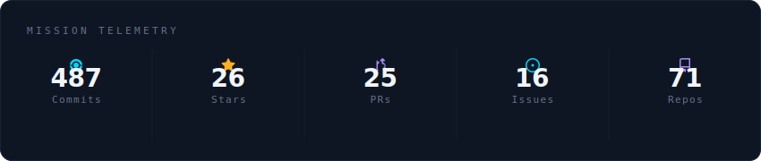

<!-- Galaxy Profile README Template
     Customize this file with your own info, then rename it to README.md
     in your GitHub profile repo (github.com/YOUR_USERNAME/YOUR_USERNAME).
     The SVG paths below point to assets/generated/ which are auto-generated
     by the GitHub Actions workflow or by running: python -m generator.main -->

  

 

  

 

  

 

  

 

<strong>More about me</strong>

 
### 🌟 Skills and Stacks

| Categoria                        | Tecnologias                                                                                                                                                                                |
|-----------------------------------|---------------------------------------------------------------------------------------------------------------------------------------------------------------------------------------------|
| **📋 Languages**     |           |
| **📚 Frameworks, Platforms and Libraries**   |          	 |
| **🌋 Code Coverage**   |  |
| **💾 Databases** |                                               |
| **📊 Data Analysis**        |       |
| **📈 Data Visualization** |      |
| **🛠️ Data Tools** |   |
| **🕓 Version Control** |    |
| **📚 Documentation and Presentation**   |   |
| **🧑‍💻 Developer/Forums**   |    |
| **🎓 Education**   |        | 
| **☁️ Hosting/SaaS**   |     |
| **💻 IDEs/Editors**   |     |
| **🤝 Collaboration Tool**   |   |
| **🎛️ Operating System**   |      |

----
### 📚 Learning

 

